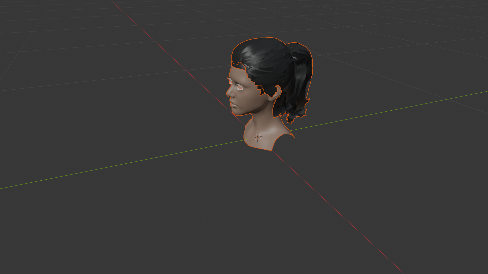

# Blender Avatar Customizer

This project contains a Blender Python script that creates a custom UI panel inside the 3D Viewport to load, color-customize, and snapshot a standard avatar FBX model.

## Features

- **Automated Setup:** Automatically clears the default scene and dynamically imports a predefined FBX model.
- **Custom UI Panel:** Adds a simplified menu to your Blender Sidebar (N-Panel) called **Avatar**.
- **Dynamic Recoloring:** Change Skin Tones and Hair Colors via simple UI dropdown selections without fiddling with the Shader Editor. Color updates happen instantly in Solid Viewport Mode.
- **Viewport Screenshot:** Easily take snapshots of your configured model from the exact angle you're viewing in the 3D workspace.

## Prerequisites & Assets

To regenerate this project directly, you will need the specific 3D model asset.

* **Asset Source:** [High-Short Ponytail Girl (Turbosquid)](https://www.turbosquid.com/FullPreview/2364958)
* **Script Location Setup:** The script is currently hardcoded to look for the downloaded FBX asset at the following path: 
  `C:\Users\loll\Desktop\dev\blender_loo\fbx_file\fbx_file.Fbx`

*(If you are setting this up on a different machine or path, make sure to update the `fbx` variable inside `belender.py` to match your new downloaded asset path).*

## How to Run

1. Open **Blender** (This script was tested in Blender 5.1).
2. Go to the **Scripting** tab at the top.
3. Open `belender.py` from this repository.
4. Hit the **Run Script** play button (or run via the VS Code Blender extension).
5. Head over to the **Layout** or 3D Viewport workspace.
6. Press the **`N`** key on your keyboard to open the right Sidebar.
7. Click the **Avatar** tab along the right edge.
8. Click **1. Load FBX & Set up** to generate the model.
9. Play with the color dropdowns.
10. Click **2. Export Image** to output a `.png` snapshot to your project folder!

## Output

Snapshots rendered via the UI button will drop into your project directory as `Snap.png`.
